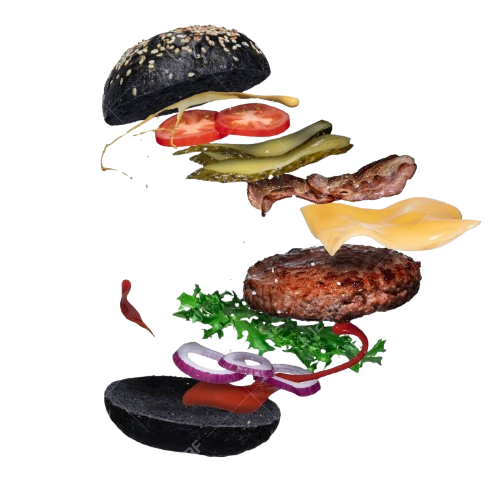
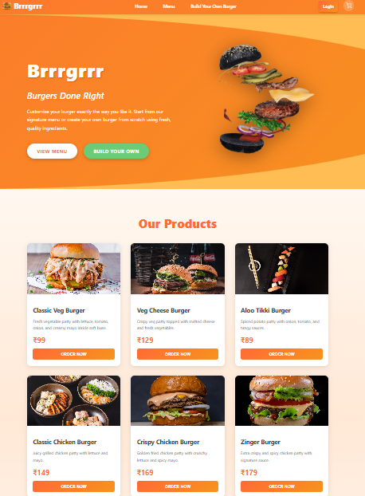
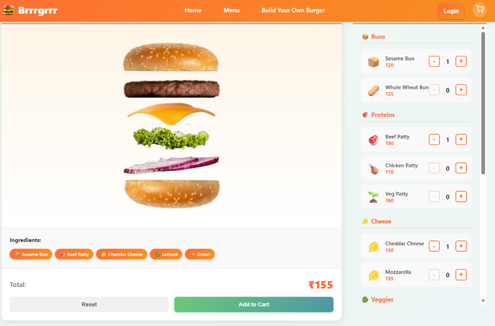

# Brrrgrrr 🍔

Welcome to **Brrrgrrr**, the ultimate burger experience! This is a modern, responsive **frontend-only** React application that allows users to explore a delicious menu of signature burgers or build their own custom burger from scratch using our interactive builder.



## 🚀 Features

-   **🍔 Build Your Own Burger**: An interactive interface to stack your favorite ingredients (Lettuce, Bacon, Cheese, Meat) and see your creation come to life in real-time.
-   **📋 Signature Menu**: Browse our selection of chef-curated burgers.
-   **🛒 Shopping Cart**: Add your custom creations or menu items to the cart and review your order.
-   **📱 Fully Responsive**: Designed to look great on desktop, tablet, and mobile devices.
-   **✨ Dynamic UI**: Smooth transitions and an engaging user interface.

## 🛠️ Technologies Used

-   **React**: For building the user interface.
-   **CSS**: Custom styling for a unique and polished look.
-   **Context API**: For managing global state like the Shopping Cart.

## 📂 Project Structure

This project is organized as a standalone frontend application:

-   `src/components`: Contains all React components (BurgerBuilder, Navbar, Cart, ProductCard, etc.).
-   `src/contexts`: React Context definitions (e.g., CartContext).
-   `src/data`: Static data files (e.g., burger menu items).
-   `public`: Static assets including images.

## 🏁 Getting Started

Since this is a frontend-only project, setting it up is straightforward.

### Prerequisites

Make sure you have **Node.js** installed on your machine.

### Installation

1.  Open your terminal in the project directory.
2.  Install the dependencies:

    ```bash
    npm install
    ```

### Running the Application

Start the development server:

```bash
npm start
```

Open [http://localhost:3000](http://localhost:3000) to view it in your browser. The page will reload when you make changes.

## 📸 Visual Preview

### Home & Menu
The application features a vibrant landing page and an easy-to-use menu system.



### Build Your Own Burger
Visit the **Build Your Own** section to try out the custom burger builder!



---

*Note: This project is strictly frontend. All data is managed locally within the application state.*
